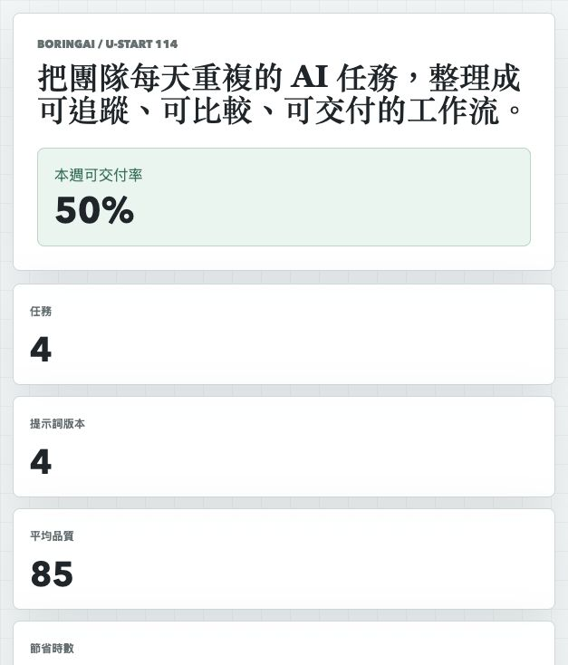
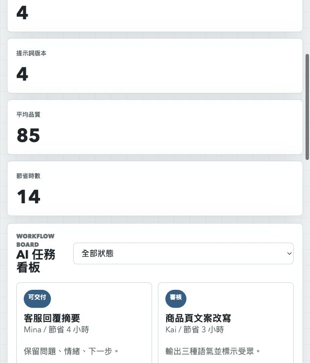

# BoringAI 工作流平台原型

## 快速看懂

- 線上 Demo：https://atlasforcn.github.io/startup-boringai-workflow/
- 這個原型在做什麼：把 BoringAI 做成 AI 工作流平台，用任務節點串起資料、模型與輸出。
- 特色定位：特色是呈現「把無聊重複工作自動化」的流程感，而不是單一聊天框。
- 操作流程：選擇工作流範本 → 設定資料輸入與 AI 任務節點 → 查看執行結果、節省時間與待處理項目

展開完整功能流程截圖

## 比賽來源

- 競賽：U-start 創新創業計畫
- 屆次：114 年度第二階段績優團隊
- 得獎作品：BoringAI
- 學校：國立臺灣科技大學
- 公司：博靈有限公司
- 類別：創新服務
- 官方來源：https://ustart.yda.gov.tw/p/405-1000-2178,c147.php?Lang=zh-tw

## 核心概念

依公開名稱與資料庫整理，本原型把 BoringAI 理解為 AI 工作流平台：用任務看板、提示詞版本、模型比較、輸出品質分數與團隊操作紀錄，讓團隊可以把重複 AI 任務變成可管理流程。

## 功能

- AI 任務看板與狀態篩選
- 新增提示詞版本
- 模型比較與品質評分
- 本週交付率、平均品質、節省時數統計

## 聲明

本 repo 是依官方公開得獎名稱建立的概念原型，不代表原團隊授權產品，也未使用原團隊商標、素材或未公開資料。
